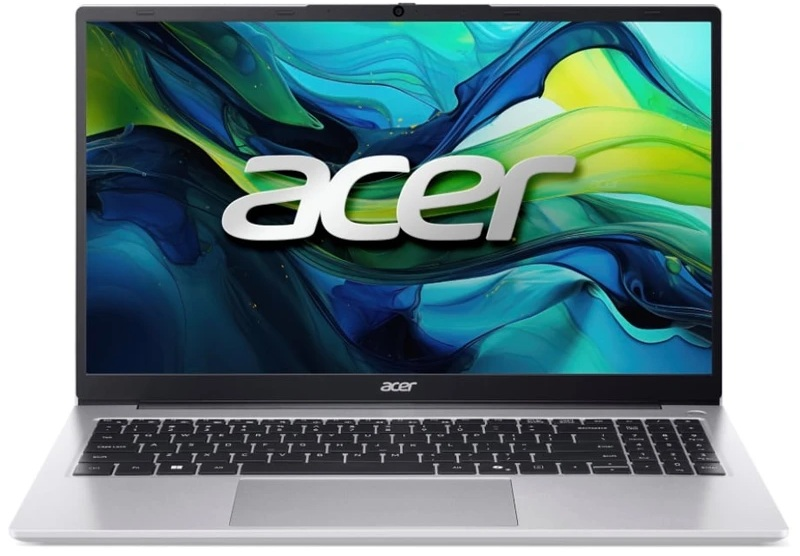
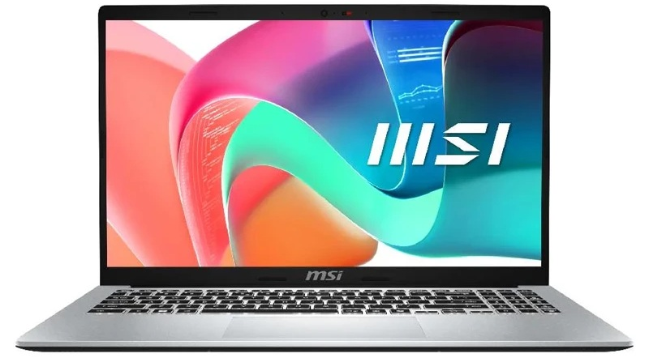
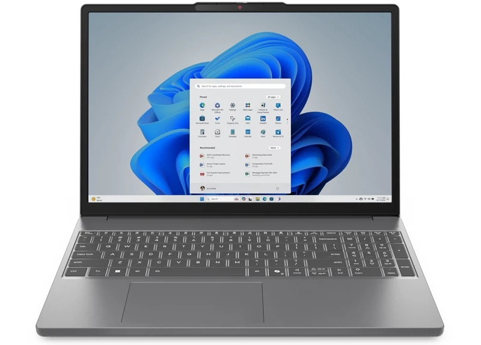
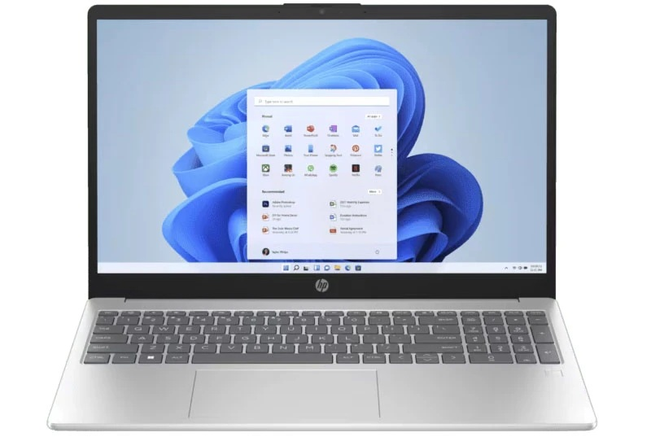
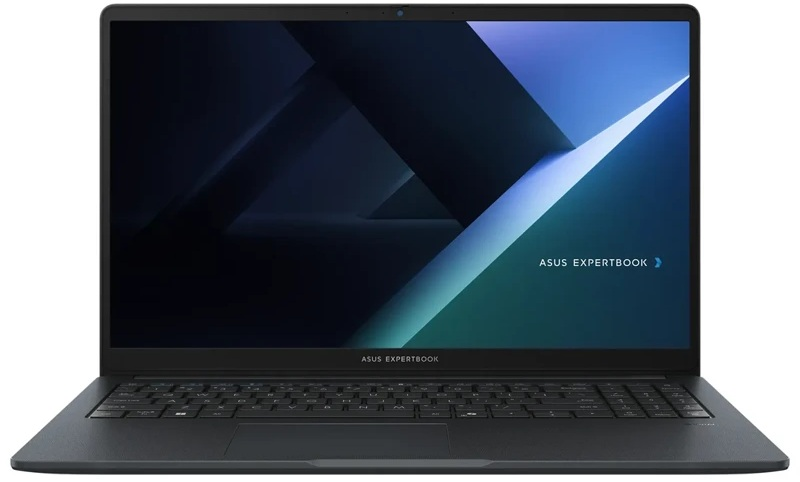

# Research Notebook: Best Laptops for Kids (< 20,000 THB)

## 🎯 Overview
Research summary of laptops/computers for kids (up to middle school age) that focus on value, powerful enough specs for long-term 3-year use, within a budget of 20,000 THB.

> **Last updated: 12 July 2026** ✅ — Prices verified from real stores (Advice, JIB, BaNANA, ASUS Store)

---

## 🏆 Top 5 Recommendations (July 2026)

### 🥇 1. Acer Aspire Lite 15 AL15-42P-R4PQ
| Spec | Detail |
|------|--------|
| CPU | AMD Ryzen 7 7730U (8-core, 16-thread) |
| RAM | 16GB DDR4 (1x SO-DIMM, upgradable) |
| Storage | 512GB NVMe PCIe Gen3 SSD |
| Display | 15.6" FHD IPS (Acer ComfyView, 45% NTSC) |
| OS | Windows 11 Home + Microsoft Office Home 2024 |
| Weight | 1.7 kg |
| **Price** | **15,990 - 16,990 THB** |
| **Store** | 🛒 [Advice](https://www.advice.co.th/branch-a013/index.php/product/productdetail/A0169276) — [BaNANA](https://www.bnn.in.th/th/p/notebook/thin-light-notebook/acer-thin-light-notebook/acer-notebook-aspire-lite-15-al15-42p-r4pq-silver-a-4711474503206_z96541) |
| **Real Photo** |  |

**Highlights:** AMD Ryzen 7 8-core — most powerful CPU under 20K, 16GB RAM, IPS display, free Office 2024, FHD webcam with Privacy Shutter ✅
**Notes:** 45% NTSC display — not ideal for heavy graphics work, no fingerprint/IR camera

### 🥈 2. MSI Modern 15 F13MG-603TH
| Spec | Detail |
|------|--------|
| CPU | Intel Core i5-1334U (10-core, 12-thread) |
| RAM | 16GB DDR4 (upgradable to 64GB) |
| Storage | 512GB NVMe PCIe Gen4 SSD |
| Display | 15.6" FHD IPS, 60Hz |
| OS | Windows 11 Home + Microsoft Office Home 2024 |
| Weight | ~1.7 kg |
| **Price** | **14,990 THB** |
| **Store** | 🛒 [BaNANA](https://www.bnn.in.th/th/p/msi-notebook-modern-15-f13mg-603th-silver-9s7-15s122-603_z3q8e9) — [Advice](https://www.advice.co.th/branch-u085/index.php/product/productdetail/A0168988) |
| **Real Photo** |  |

**Highlights:** Cheapest in class with specs that match pricier models, RAM up to 64GB (2 Slots), Backlit Keyboard, Copilot Key, genuine Office ✅
**Notes:** 45.6Whr battery — moderate battery life, single SSD slot only

### 🥉 3. Lenovo IdeaPad Slim 3i 14IRH10 (83K0004WTA)
| Spec | Detail |
|------|--------|
| CPU | Intel Core i5-13420H (8-core, 12-thread, H-series 45W) |
| RAM | 8GB Onboard + 8GB SO-DIMM DDR5 (16GB total, max 24GB) |
| Storage | 512GB NVMe PCIe Gen4 SSD + extra M.2 slot |
| Display | 14" WUXGA (1920×1200) IPS, 300nits |
| OS | Windows 11 Home + Microsoft Office Home 2024 |
| Weight | **1.39 kg** (lightest!) |
| **Price** | **16,990 - 17,990 THB** |
| **Store** | 🛒 [BaNANA](https://www.bnn.in.th/en/p/notebook/thin-light-notebook/lenovo-thin-light-notebook/lenovo-notebook-ideapad-slim-3i-14irh10-83k0004wta-grey-198156959058_dxy561) — [JIB](https://www.jib.co.th/web/product/readProduct/76600/1820/NOTEBOOK--%E0%B9%82%E0%B8%99%E0%B9%89%E0%B8%95%E0%B8%9A%E0%B8%B8%E0%B9%8A%E0%B8%84--LENOVO-IDEAPAD-SLIM-3-14IRH10-83K0004WTA---LUNA-GREY) |
| **Real Photo** |  |

**Highlights:** Lightest at 1.39kg, 16:10 widescreen easy on the eyes, IR camera for Windows Hello face unlock, dual SSD slots ✅
**Notes:** Onboard 8GB + SO-DIMM 8GB RAM (max 24GB), no backlit keyboard

### 4. HP 15-fr0024TU
| Spec | Detail |
|------|--------|
| CPU | Intel Core i5-13500H (12-core, 16-thread, H-series 45W) |
| RAM | 16GB (2x 8GB) DDR4 |
| Storage | 512GB NVMe SSD |
| Display | 15.6" FHD IPS, micro-edge, anti-glare, 300nits |
| OS | Windows 11 Home + Microsoft Office Home 2024 |
| Weight | ~1.7 kg |
| **Price** | **16,490 - 17,990 THB** |
| **Store** | 🛒 [Advice](https://www.advice.co.th/branch-a003/index.php/product/productdetail/A0169144) — [BaNANA](https://www.bnn.in.th/th/p/hp-notebook-15-fr0024tu-silver-199251476600_rqegj2) — [JIB](https://www.jib.co.th/web/product/readProduct/77975/NOTEBOOK--%E0%B9%82%E0%B8%99%E0%B9%89%E0%B8%95%E0%B8%9A%E0%B8%B8%E0%B9%8A%E0%B8%84--HP-15-FR0024TU---SILVER) |
| **Real Photo** |  |

**Highlights:** Most powerful CPU in class — H-series 45W, HP on-site after-sales service, Bluetooth 5.4 ✅
**Notes:** 41Whr battery — only 4-5 hrs runtime (power-hungry CPU), no card reader

### 5. ASUS ExpertBook B1 B1503CVA-S76212
| Spec | Detail |
|------|--------|
| CPU | Intel Core 5 120U (10-core, 12-thread) |
| RAM | 16GB DDR5 SO-DIMM (2 Slots) |
| Storage | 512GB NVMe PCIe Gen4 SSD |
| Display | 15.6" FHD IPS |
| OS | **DOS** (no Windows — install yourself) |
| Weight | ~1.7 kg |
| **Price** | **17,990 THB** |
| **Store** | 🛒 [ASUS Online Store](https://th.store.asus.com/asus-expertbook-b1-b1503cva-s76212.html) — [Notebookspec](https://notebookspec.com/notebook/14274-asus-expertbook-b1-b1503cva-s76212.html) |
| **Real Photo** |  |

**Highlights:** MIL-STD 810H certified (drop/shock/spill resistant), 2x USB-C Full Function, spill-proof keyboard, RAM upgradable to 64GB ✅
**Notes:** No Windows or Office included — must install yourself (or use Linux), highest price in the group

---

## 💰 Promotions & Deals (July 2026)

### 🏪 BaNANA — Happy Deal Mid-Year Sale
- Laptops up to **7,000 THB off**
- 0% installment up to 24 months
- Cash back up to 2,500 THB
- Free 3-month Canva Pro with registration
- [View deal](https://instore.bnn.in.th/banana-monthly-promotion)

### 🏪 JIB Computer — Goal of Savings
- 0% installment up to **36 months**
- Cash back up to 25,000 THB
- [View deal](https://www.jib.co.th/web/promotion_zero/detail/6235/)

### 🏪 Advice
- 0% installment up to **36 months**
- Cash back up to 40,000 THB
- [View deal](https://www.advice.co.th/article/Bank-Promotion-Apr-2026)

### 🏪 ASUS Back to School 2026
- Student discount up to **4,749.50 THB**
- [View details](https://th.store.asus.com/asus-back-to-school-2026)

### 💳 Credit Card Promotions (0% Installment)
| Bank | Installment Period | Cash Back |
|------|-------------------|-----------|
| Krungsri First Choice | Up to 24 months | Per promotion |
| KTC | Up to 24 months | Up to 24,000 THB |
| KBank | Up to 10 months | Per promotion |
| Bangkok Bank M Visa | Up to 10 months | Per promotion |

---

## 🧠 Decision Guide: How to Choose for Your Child

| Need | Recommended Model | Reason |
|------|-------------------|--------|
| General use, school, frequent carrying | **Lenovo IdeaPad Slim 3i (14")** | Lightest 1.39kg, 16:10 display, face unlock |
| Office work, big screen, performance | **Acer Aspire Lite 15 (Ryzen 7)** | 8-core CPU, 16GB RAM, IPS, genuine Office |
| Clumsy kid, rough handling | **ASUS ExpertBook B1** | MIL-STD shock resistant, spill-proof keyboard |
| Tightest budget, good specs | **MSI Modern 15 (14,990)** | Cheapest, genuine Office, RAM up to 64GB |
| Battery life, lightweight | **Lenovo IdeaPad Slim 3i (14")** | 50Wh battery, smaller screen = less power, lightest |

---

## 🔍 Summary for Parents

**Clover's recommendation for kids up to middle school:**

1. **🥇 Best value + power + big screen → Acer Aspire Lite 15 (Ryzen 7)** = 16,990 THB  
   Fastest 8-core CPU, 16GB RAM, genuine Office, 15.6" IPS

2. **🥇 Light + portable + 16:10 display → Lenovo IdeaPad Slim 3i 14"** = 16,990 THB  
   Just 1.39kg, face unlock, wide screen easy to read

3. **💰 Most affordable → MSI Modern 15** = 14,990 THB  
   Specs comparable to 17K models at a 14K price

4. **🛡️ Clumsy kid → ASUS ExpertBook B1** = 17,990 THB  
   Military-grade durability + spill-proof keyboard (+ Windows cost)

**Pro tip:** Shop during BaNANA Happy Deal (up to 7,000 THB off), use Krungsri/KTC card for 0% installment over 24 months, or check ASUS Back to School for extra 4,749 THB student discount.

*Last updated: 12 July 2026 — Please verify in-store prices before purchasing.*
